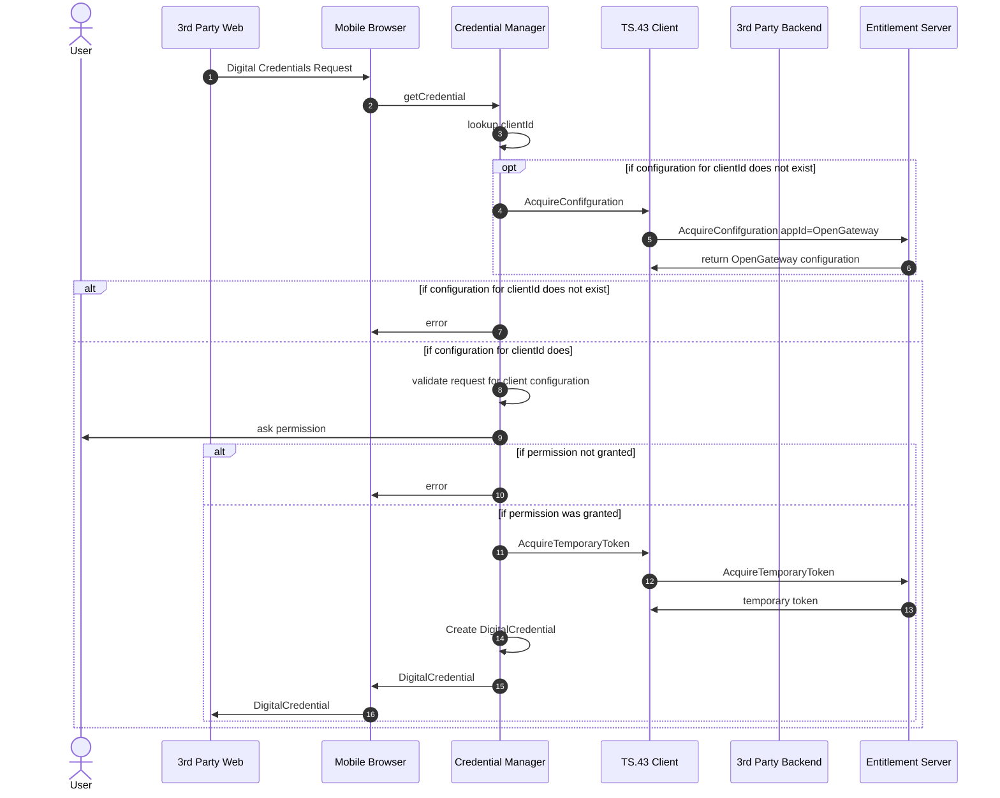

# Digital Credentials Test

# Sequence Diagram

```mermaid
sequenceDiagram
    autonumber
    actor User
    participant web as 3rd Party Web
    participant browser as Mobile Browser
    participant credman as Credential Manager
    participant ts43client as TS.43 Client
    participant backend as 3rd Party Backend
    participant ecs as Entitlement Server
    web->>browser: Digital Credentials Request
    browser->> credman: getCredential
    credman->>credman: lookup clientId
    opt if configuration for clientId does not exist
        credman->>ts43client: AcquireConfifguration
        ts43client->>ecs: AcquireConfifguration appId=OpenGateway
        ecs->>ts43client: return OpenGateway configuration
    end
    alt if configuration for clientId does not exist
        credman->>browser: error
    else if configuration for clientId does
        credman->>credman: validate request for client configuration 
        credman->>User: ask permission
        alt if permission not granted
            credman->>browser: error
        else if permission was granted
            credman->>ts43client: AcquireTemporaryToken
            ts43client->>ecs: AcquireTemporaryToken
            ecs->>ts43client: temporary token
            credman->>credman: Create DigitalCredential
            credman->>browser: DigitalCredential
            browser->>web: DigitalCredential
        end
    end
```
