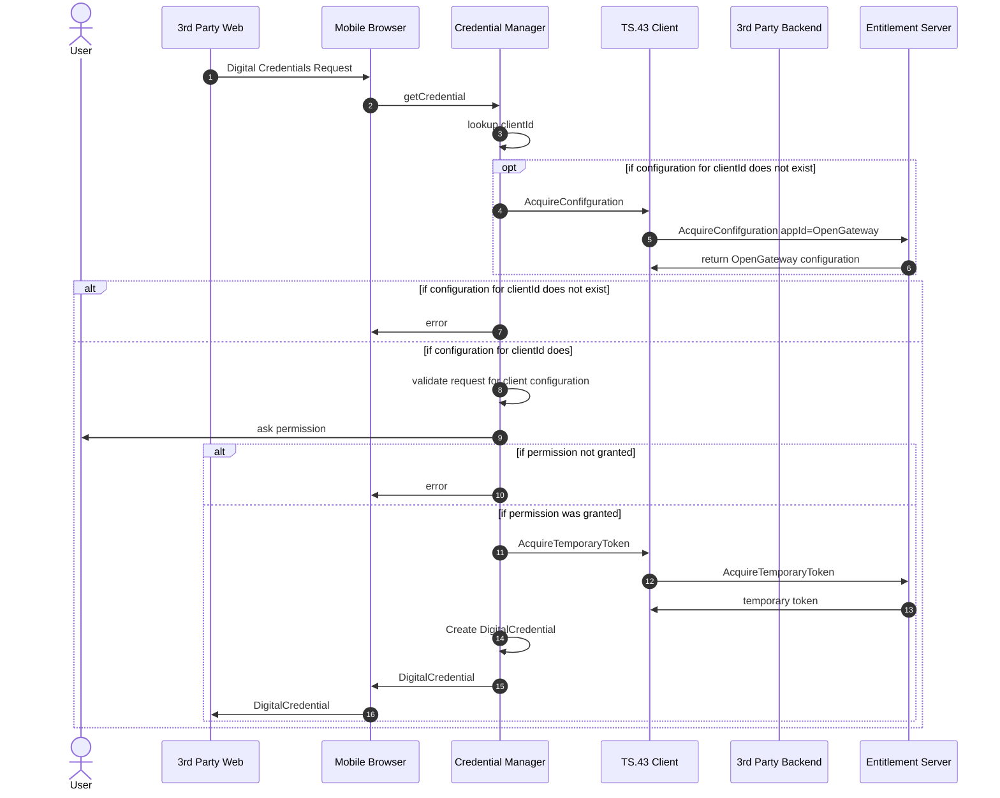

# Digital Credentials Test

# Sequence Diagram



## Digital Credentials Request

## AcquireConfiguration

Fictional AcquireConfiguration request and response based on TS.43 v12

### Request 

Fictional TS.43 AcquireConfiguration for application ap_ogw
```HTTP
GET ? terminal_id = 013787006099944&
token = es7w1erXjh%2FEC%2FP8BV44SBmVipg&
terminal_vendor = TVENDOR&
terminal_model = TMODEL&
terminal_sw_version = TSWVERS&
entitlement_version = ENTVERS&
app = ap_ogw&
operation = AcquireConfiguration&
companion_terminal_id = 98112687006099944&
vers = 1 HTTP/1.1
MSG_character_display_limits=55,270,20,20,40,45
Host: entitlement.telco.net:9014
User-Agent: PRD-TS43 TVENDOR/TMODEL Primary-ODSA/TSWVERS OS-Android/8.0
Accept: application/json
Accept-Language: de-DE,en;q=0.5
Accept-Encoding: gzip, deflate
Connection: keep-alive
```


### Response

The language used in the response depends on the `Accept-Language`.

```json
{
  "Vers": {
    "version": "1",
    "validity": "172800"
  },
  "Token": {
    "token": "ASH127AHHA88SF"
  },
  "ap_ogw": {
    "dc_requestor_authorizations": [
      {
        "id": "aggregator1",
        "scopes": [
          "number-verification:verify",
          "number-verification:device-phone-number:read"
        ],
        "authorization": "...",
        "privacy_policy": {
          "policy_link": "https://datenschutz.aggregator1.de/"
        },
        "consent_text": [
          {
            "number-verification:verify": "Vertrauen ist gut, Kontrolle ist besser...",
            "number-verification:device-phone-number:read": "Danke für Ihr Vertrauen..."
          }
        ]
      }
    ]
  }
}
```

If the Entitlement Server sends configuration texts in other languages then the scheme used in OpenID Connect core is used e.g.

```json
        "consent_text:en_US": [
          {
            "number-verification:verify": "These are not the Androids you are looking for...",
            "number-verification:device-phone-number:read": "They are scanning us..."
          }
        ]
```


# Digital Credentials Dev

Example openid4vp request used at [https://digital-credentials.dev/rider](https://digital-credentials.dev/rider) 

```json
{
  "protocol": "openid4vp-v1-unsigned",
  "request": {
    "dcql_query": {
      "credentials": [
        {
          "format": "dc-authorization+sd-jwt",
          "id": "aggregator1",
          "meta": {
            "credential_authorization_jwt": "eyJhbGciOiJFUzI1NiIsInR5cCI6Im9hdXRoLWF1dGh6LXJlcStqd3QiLCJ4NWMiOlsiTUlJQ3BUQ0NBa3VnQXdJQkFnSVVDOWZOSnBkVU1RWWRCbDFuaDgrUml0UndNRDh3Q2dZSUtvWkl6ajBFQXdJd2VERUxNQWtHQTFVRUJoTUNWVk14RXpBUkJnTlZCQWdNQ2tOaGJHbG1iM0p1YVdFeEZqQVVCZ05WQkFjTURVMXZkVzUwWVdsdUlGWnBaWGN4R3pBWkJnTlZCQW9NRWtWNFlXMXdiR1VnUVdkbmNtVm5ZWFJ2Y2pFZk1CMEdBMVVFQXd3V1pYaGhiWEJzWlMxaFoyZHlaV2RoZEc5eUxtUmxkakFlRncweU5UQTFNVEV5TWpRd01EVmFGdzB6TlRBME1qa3lNalF3TURWYU1IZ3hDekFKQmdOVkJBWVRBbFZUTVJNd0VRWURWUVFJREFwRFlXeHBabTl5Ym1saE1SWXdGQVlEVlFRSERBMU5iM1Z1ZEdGcGJpQldhV1YzTVJzd0dRWURWUVFLREJKRmVHRnRjR3hsSUVGblozSmxaMkYwYjNJeEh6QWRCZ05WQkFNTUZtVjRZVzF3YkdVdFlXZG5jbVZuWVhSdmNpNWtaWFl3V1RBVEJnY3Foa2pPUFFJQkJnZ3Foa2pPUFFNQkJ3TkNBQVJRcW5LTGw5U2g4dFcwM0h5aVBnOVRUcGlyQVg2V2haKzlJSWhVWFJGcDlxRFM0eW5YeG1GbjMzWk5nMTlQR1VzRWpxNGwzam9Penh2cHhqWDRoL1JlbzRHeU1JR3ZNQjBHQTFVZERnUVdCQlFBV1I5czRrWFRjeHJPeTFLSE12UldTSkg5YmpBZkJnTlZIU01FR0RBV2dCUUFXUjlzNGtYVGN4ck95MUtITXZSV1NKSDliakFQQmdOVkhSTUJBZjhFQlRBREFRSC9NQTRHQTFVZER3RUIvd1FFQXdJSGdEQXBCZ05WSFJJRUlqQWdoaDVvZEhSd2N6b3ZMMlY0WVcxd2JHVXRZV2RuY21WbllYUnZjaTVqYjIwd0lRWURWUjBSQkJvd0dJSVdaWGhoYlhCc1pTMWhaMmR5WldkaGRHOXlMbU52YlRBS0JnZ3Foa2pPUFFRREFnTklBREJGQWlCeERROUZiby9EUVRkbVNaS0NURUlHOXZma0JkWU5jVHcxUkkzT0k2L25KUUloQUw1NmU3YkVNOTlSTTFTUDAyd3gzbHhxZFZCWnhiVEhJcllCQkY3Y0FzYjMiXX0.eyJpc3MiOiAiZGNhZ2dyZWdhdG9yLmRldiIsICJub25jZSI6ICJFdmNFTU9RY0pHcTY5Z0hjM3hrWkFjd2FWcFltUEtoOHIxNkdUUnRCQWdVIiwgImVuY3J5cHRlZF9yZXNwb25zZV9lbmNfdmFsdWVzX3N1cHBvcnRlZCI6IFsiQTEyOEdDTSJdLCAiandrcyI6IHsia2V5cyI6IFt7Imt0eSI6ICJFQyIsICJ1c2UiOiAiZW5jIiwgImFsZyI6ICJFQ0RILUVTIiwgImtpZCI6ICIxIiwgImNydiI6ICJQLTI1NiIsICJ4IjogIndzTkdsLU1IUThNeUMxOE9vTGszRzh5MTRxdkxRVHNGbVFtMVBLV291QWMiLCAieSI6ICJBdmljRHhjSHZMUFd4NjZuREFDZVdHZVd3WVJOeENfengxVUZlcXNHYmNvIn1dfSwgImNvbnNlbnRfZGF0YSI6ICJleUpqYjI1elpXNTBYM1JsZUhRaU9pQWlVbWxrWlhJZ2NISnZZMlZ6YzJWeklIbHZkWElnY0dWeWMyOXVZV3dnWkdGMFlTQmhZMk52Y21ScGJtY2dkRzhnYjNWeUlIQnlhWFpoWTNrZ2NHOXNhV041SWl3Z0luQnZiR2xqZVY5c2FXNXJJam9nSW1oMGRIQnpPaTh2WkdWMlpXeHZjR1Z5TG1GdVpISnZhV1F1WTI5dEwybGtaVzUwYVhSNUwyUnBaMmwwWVd3dFkzSmxaR1Z1ZEdsaGJITXZZM0psWkdWdWRHbGhiQzEyWlhKcFptbGxjaUlzSUNKd2IyeHBZM2xmZEdWNGRDSTZJQ0pNWldGeWJpQmhZbTkxZENCd2NtbDJZV041SUhCdmJHbGplU0o5In0.ECpiMaJgeqhTTv08FVxlxQFWPmrkXuHPd_WqvhA-IYtkIK-eyCyCCoXIRr9_Z7eiSaVRx6QvmnlMttwerMSG4Q",
            "vct_values": [
              "number-verification/device-phone-number/ts43"
            ]
          }
        }
      ]
    },
    "nonce": "EvcEMOQcJGq69gHc3xkZAcwaVpYmPKh8r16GTRtBAgU",
    "response_mode": "dc_api",
    "response_type": "vp_token"
  },
  "state": {
    "aggregator_session": {
      "enc_key": "{\"alg\":\"ECDH-ES\",\"crv\":\"P-256\",\"d\":\"VfaJpclFTEPxLQdAScnPPvQICxtOO7lu9SPYMApRH8s\",\"kid\":\"1\",\"kty\":\"EC\",\"use\":\"enc\",\"x\":\"wsNGl-MHQ8MyC18OoLk3G8y14qvLQTsFmQm1PKWouAc\",\"y\":\"AvicDxcHvLPWx66nDACeWGeWwYRNxC_zx1UFeqsGbco\"}",
      "nonce": "EvcEMOQcJGq69gHc3xkZAcwaVpYmPKh8r16GTRtBAgU",
      "session_key": "session_12345678"
    },
    "credential_type": "dc-authorization+sd-jwt",
    "nonce": "EvcEMOQcJGq69gHc3xkZAcwaVpYmPKh8r16GTRtBAgU",
    "private_key": "FvrhTn2rBxy-G7ciBc_3m5baKXUFLl0BPCDoA8ju4FM=",
    "public_key": "BPIKxn1PfTS2jQEhew3gigVjR4hfWXEo7v7eZ0sZAicqRviFtLRvqBTJGpK8GRlH83S8wjVN54IZ_UsSk2imy8Q="
  }
}
```

# References and Useful Links

- [TS.43 v12.0 Service Entitlement Configuration](https://www.gsma.com/get-involved/working-groups/gsma_resources/ts-43-v12-0-service-entitlement-configuration/)
- [Sign in your user with Credential Manager](https://developer.android.com/identity/sign-in/credential-manager)
- [Verify phone numbers with digital credentials](https://developer.android.com/identity/digital-credentials/phone-number-verification)
- [OpenID for Verifiable Presentations 1.0](https://openid.net/specs/openid-4-verifiable-presentations-1_0.html)
- Linux Foundation [CAMARA Project](https://lf-camaraproject.atlassian.net/wiki/spaces/CAM/overview?mode=global)
- GSMA [OpenGateway](https://www.gsma.com/solutions-and-impact/gsma-open-gateway/)
- 


